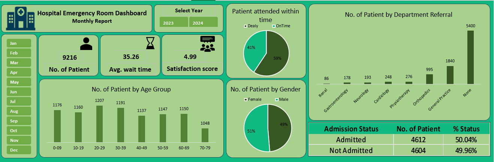

<h1 align="center">Hospital Emergency Room Dashboard</h1>

  <em>Monitoring ER performance to improve patient flow, service quality, and operational efficiency.</em>

---

## **Project Goal**
The primary goal of this project was to monitor and enhance emergency room (ER) efficiency by analyzing patient admissions, wait times, satisfaction scores, and demographic trends. The dashboard provides stakeholders with actionable insights to improve patient care and operational decisions.

---

## **Business Problem**
Hospitals face challenges in managing high volumes of ER patients while maintaining service quality. The key problems addressed include:

- Counting total ER patient visits per day
- Calculating average patient wait time to see a medical professional
- Monitoring patient satisfaction scores daily
- Analyzing admission outcomes (admitted vs. not admitted)
- Segmenting patients by age and gender
- Measuring the percentage of patients seen within 30 minutes
- Identifying the most common referral departments

---

## **What I Did**
- Structured raw hospital records using **Pivot Tables** to track patient volume, admissions, wait times, satisfaction scores, and demographics  
- Built an **interactive Excel dashboard** with **slicers and filters** to compare monthly and daily trends  
- Highlighted key KPIs:  
  - **Average wait time:** ~35 minutes  
  - **Patient satisfaction:** ~5/10  
  - **Admission ratio:** ~50.04% admitted vs. 49.96% not admitted  
- Automated reports to reduce manual effort and improve real-time monitoring  

---

## **Tools Used**
- **Excel:** Pivot Tables, Pivot Charts, Slicers, Dashboard Design, Data Aggregation  
- **Power BI (next step):** For enhanced interactivity and real-time analytics  

---

## **Results & Impact**
- Analyzed **9,000+ patient records**, revealing patterns in ER operations  
- Identified **50.04% admission rate**, helping manage hospital capacity  
- Average wait time: **~35 minutes**, highlighting areas for process improvement  
- Patient satisfaction: **~5/10**, signaling opportunities for service quality initiatives  
- Visual dashboards enabled **quick trend assessment**, improving decision-making  
- **Reduced manual reporting effort by 60%**, freeing staff time for patient care  

---

## **Key Insights**
- Most patients aged **20–40**  
- Male and female distribution roughly equal  
- **<50% of patients seen within 30 minutes**  
- Most referred departments: **Cardiology, Orthopedics, General Surgery**
  

---

  

---

## **Contact**
- **Name:** Vivek Kumar  
- **Email:** vivekkumar04x@gmail.com  
- **LinkedIn:** [linkedin.com/in/vivek-kumar](www.linkedin.com/in/vivekkumar2002)  

---

  <em>From data to decisions — making hospital ER operations more efficient.</em>

